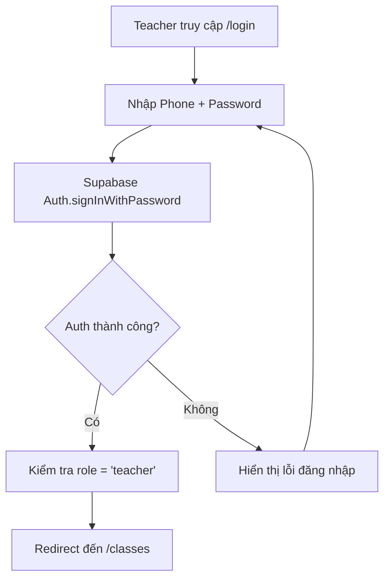
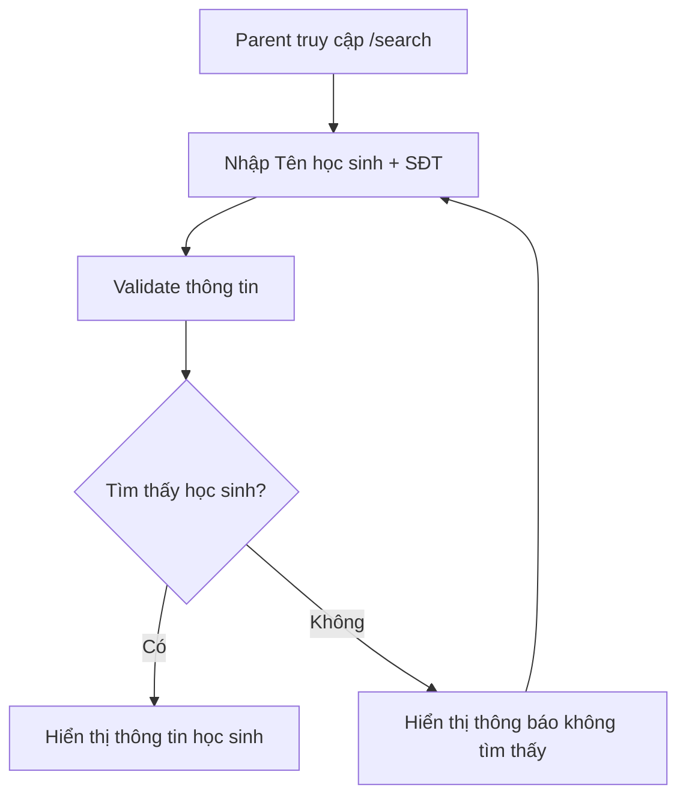

# Authentication Flow - Luồng xác thực

Tài liệu này mô tả chi tiết luồng xác thực và phân quyền trong ứng dụng Quản lý Trung tâm Piano.

## 1. Tổng quan

Hệ thống sử dụng **Supabase Auth** để quản lý xác thực cho Admin và Teacher, với Parent không cần đăng nhập.

## 2. Các vai trò và phương thức đăng nhập

### 2.1. Admin

- **Phương thức**: Email + Password
- **Xác thực**: Không cần verify email
- **Tạo tài khoản**: Được tạo sẵn bởi developer
- **Metadata**: `{"role": "admin"}` trong `raw_app_meta_data`

### 2.2. Teacher

- **Phương thức**: Phone + Password
- **Xác thực**: Không cần OTP/SMS
- **Tạo tài khoản**: Admin tạo qua Supabase Admin API
- **Metadata**: `{"role": "teacher"}` trong `raw_app_meta_data`

### 2.3. Parent

- **Phương thức**: Không cần đăng nhập
- **Truy cập**: Trang tra cứu công khai
- **Bảo mật**: Nhập tên học sinh + SĐT để tra cứu

## 3. Luồng đăng nhập chi tiết

### 3.1. Admin Login Flow


**Chi tiết:**

1. Admin truy cập `/login`
2. Nhập email và password
3. Gọi `supabase.auth.signInWithPassword({ email, password })`
4. Kiểm tra `user.user_metadata.role === 'admin'`
5. Redirect đến `/dashboard` nếu thành công

### 3.2. Teacher Login Flow



**Chi tiết:**

1. Teacher truy cập `/login`
2. Nhập phone và password
3. Gọi `supabase.auth.signInWithPassword({ phone, password })`
4. Kiểm tra `user.user_metadata.role === 'teacher'`
5. Redirect đến `/classes` nếu thành công

### 3.3. Parent Search Flow



**Chi tiết:**

1. Parent truy cập `/search` (không cần đăng nhập)
2. Nhập tên học sinh và số điện thoại
3. Query database tìm học sinh khớp
4. Hiển thị thông tin nếu tìm thấy

## 4. Middleware và Route Protection

### 4.1. Middleware Structure

```typescript
// middleware.ts
import { createMiddlewareClient } from "@supabase/auth-helpers-nextjs";
import { NextResponse } from "next/server";
import type { NextRequest } from "next/server";

export async function middleware(req: NextRequest) {
  const res = NextResponse.next();
  const supabase = createMiddlewareClient({ req, res });

  const {
    data: { session },
  } = await supabase.auth.getSession();

  // Public routes (không cần auth)
  const publicRoutes = ["/search"];
  if (publicRoutes.some((route) => req.nextUrl.pathname.startsWith(route))) {
    return res;
  }

  // Auth routes
  if (req.nextUrl.pathname.startsWith("/login")) {
    if (session) {
      // Redirect based on role
      const role = session.user.user_metadata?.role;
      if (role === "admin") {
        return NextResponse.redirect(new URL("/dashboard", req.url));
      } else if (role === "teacher") {
        return NextResponse.redirect(new URL("/classes", req.url));
      }
    }
    return res;
  }

  // Protected routes
  if (!session) {
    return NextResponse.redirect(new URL("/login", req.url));
  }

  // Role-based access control
  const role = session.user.user_metadata?.role;

  if (req.nextUrl.pathname.startsWith("/dashboard") && role !== "admin") {
    return NextResponse.redirect(new URL("/classes", req.url));
  }

  if (req.nextUrl.pathname.startsWith("/classes") && role !== "teacher") {
    return NextResponse.redirect(new URL("/dashboard", req.url));
  }

  return res;
}

export const config = {
  matcher: ["/((?!api|_next/static|_next/image|favicon.ico).*)"],
};
```

### 4.2. Route Groups Protection

- **`(admin)`**: Chỉ Admin có thể truy cập
- **`(teacher)`**: Chỉ Teacher có thể truy cập
- **`(parent)`**: Không cần auth, ai cũng truy cập được
- **`(auth)`**: Chỉ user chưa đăng nhập

## 5. Session Management

### 5.1. Client-side Auth Hook

```typescript
// lib/hooks/use-auth.ts
import { useEffect, useState } from "react";
import { User } from "@supabase/supabase-js";
import { supabase } from "@/lib/supabase/client";

export const useAuth = () => {
  const [user, setUser] = useState<User | null>(null);
  const [loading, setLoading] = useState(true);

  useEffect(() => {
    // Get initial session
    const getSession = async () => {
      const {
        data: { session },
      } = await supabase.auth.getSession();
      setUser(session?.user ?? null);
      setLoading(false);
    };

    getSession();

    // Listen for auth changes
    const {
      data: { subscription },
    } = supabase.auth.onAuthStateChange(async (event, session) => {
      setUser(session?.user ?? null);
      setLoading(false);
    });

    return () => subscription.unsubscribe();
  }, []);

  const signOut = async () => {
    await supabase.auth.signOut();
  };

  return {
    user,
    loading,
    signOut,
    isAdmin: user?.user_metadata?.role === "admin",
    isTeacher: user?.user_metadata?.role === "teacher",
  };
};
```

### 5.2. Server-side Auth Helper

```typescript
// lib/supabase/server.ts
import { createServerClient } from "@supabase/ssr";
import { cookies } from "next/headers";

export const createClient = () => {
  const cookieStore = cookies();

  return createServerClient(
    process.env.NEXT_PUBLIC_SUPABASE_URL!,
    process.env.NEXT_PUBLIC_SUPABASE_ANON_KEY!,
    {
      cookies: {
        get(name: string) {
          return cookieStore.get(name)?.value;
        },
      },
    }
  );
};

// Helper để lấy user từ server
export const getUser = async () => {
  const supabase = createClient();
  const {
    data: { user },
  } = await supabase.auth.getUser();
  return user;
};
```

## 6. User Creation Process

### 6.1. Tạo Admin User (Initial Setup)

```typescript
// scripts/create-admin.ts
import { createClient } from "@supabase/supabase-js";

const supabase = createClient(
  process.env.NEXT_PUBLIC_SUPABASE_URL!,
  process.env.SUPABASE_SERVICE_ROLE_KEY! // Service role key
);

const createAdmin = async () => {
  const { data, error } = await supabase.auth.admin.createUser({
    email: "admin@piano-center.com",
    password: "admin123",
    email_confirm: true, // Skip email verification
    user_metadata: {
      role: "admin",
    },
  });

  if (error) {
    console.error("Error creating admin:", error);
  } else {
    console.log("Admin created successfully:", data.user);
  }
};
```

### 6.2. Admin tạo Teacher User

```typescript
// lib/repositories/teachers.repository.ts
import { supabase } from "@/lib/supabase/server";

export const teachersRepository = {
  createTeacherUser: async (
    phone: string,
    password: string,
    teacherData: any
  ) => {
    // Tạo auth user
    const { data: authUser, error: authError } =
      await supabase.auth.admin.createUser({
        phone,
        password,
        phone_confirm: true, // Skip phone verification
        user_metadata: {
          role: "teacher",
        },
      });

    if (authError) throw authError;

    // Tạo teacher record
    const { data: teacher, error: teacherError } = await supabase
      .from("teachers")
      .insert({
        id: authUser.user.id,
        phone,
        ...teacherData,
      })
      .select()
      .single();

    if (teacherError) throw teacherError;

    return teacher;
  },
};
```

## 7. Error Handling

### 7.1. Auth Error Types

```typescript
// lib/types/auth.ts
export type AuthError = {
  message: string;
  code: string;
};

export const AUTH_ERRORS = {
  INVALID_CREDENTIALS: "Invalid login credentials",
  USER_NOT_FOUND: "User not found",
  WRONG_PASSWORD: "Wrong password",
  EMAIL_NOT_CONFIRMED: "Email not confirmed",
  PHONE_NOT_CONFIRMED: "Phone not confirmed",
} as const;
```

### 7.2. Error Handling trong Components

```typescript
// components/forms/login-form.tsx
const handleLogin = async (data: LoginFormData) => {
  try {
    const { error } = await supabase.auth.signInWithPassword({
      email: data.email, // hoặc phone
      password: data.password,
    });

    if (error) {
      toast.error(getErrorMessage(error.message));
      return;
    }

    // Redirect sẽ được handle bởi middleware
  } catch (error) {
    toast.error("Có lỗi xảy ra, vui lòng thử lại");
  }
};
```

## 8. Security Considerations

### 8.1. Password Policy

- Minimum 8 characters
- Require uppercase, lowercase, number
- No common passwords

### 8.2. Session Security

- JWT tokens với expiration time hợp lý
- Automatic token refresh
- Secure cookie settings

### 8.3. Rate Limiting

- Limit login attempts per IP
- Implement CAPTCHA sau nhiều lần thất bại

## 9. Testing Strategy

### 9.1. Unit Tests

- Test auth hooks
- Test middleware logic
- Test user creation functions

### 9.2. Integration Tests

- Test complete login flow
- Test role-based redirects
- Test session persistence

## 10. Deployment Notes

### 10.1. Environment Variables

```env
NEXT_PUBLIC_SUPABASE_URL=your_supabase_url
NEXT_PUBLIC_SUPABASE_ANON_KEY=your_anon_key
SUPABASE_SERVICE_ROLE_KEY=your_service_role_key
```

### 10.2. Supabase Configuration

- Enable email/password auth
- Enable phone/password auth
- Disable email confirmation
- Disable phone confirmation
- Set up proper redirect URLs

---

## 11. Tóm tắt

- **Admin**: Email + Password → `/dashboard`
- **Teacher**: Phone + Password → `/classes`
- **Parent**: Không cần auth → `/search`
- **Middleware**: Bảo vệ routes dựa trên role
- **Session**: Quản lý tự động bởi Supabase Auth
- **Security**: JWT tokens, rate limiting, password policy
