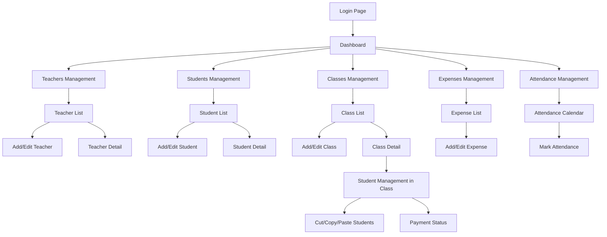
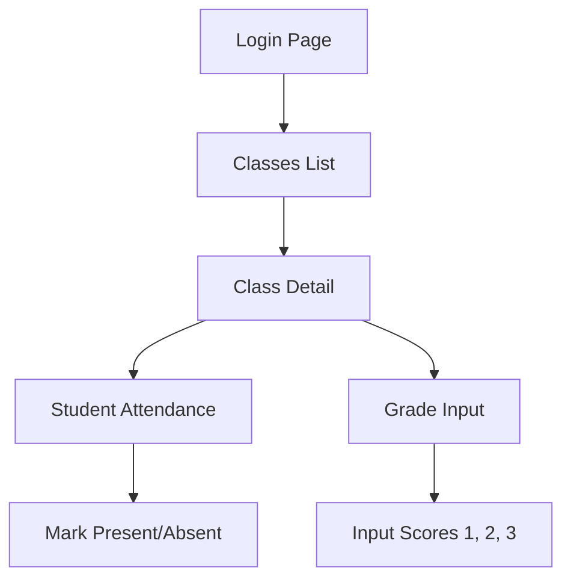
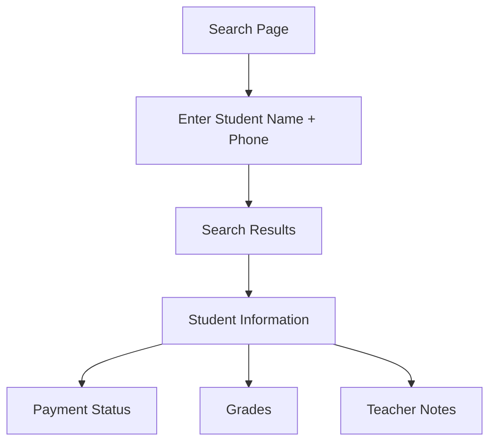

# UI/UX Flow - Luồng giao diện và trải nghiệm người dùng

Tài liệu này mô tả chi tiết luồng giao diện, trải nghiệm người dùng và các nguyên tắc thiết kế cho ứng dụng Quản lý Trung tâm Piano.

## 1. Tổng quan

Ứng dụng được thiết kế với nguyên tắc **đơn giản, thân thiện và responsive**, đáp ứng tốt trên cả máy tính và thiết bị di động.

## 2. Nguyên tắc thiết kế cốt lõi

### 2.1. Responsive Design

- **Desktop**: Layout đầy đủ với sidebar navigation
- **Tablet**: Responsive layout với collapsible sidebar
- **Mobile**: Hamburger menu, bottom navigation, tables chuyển thành cards

### 2.2. Consistent Spacing System

```css
/* Spacing scale - Compact Design */
--space-1: 0.25rem; /* 4px */
--space-2: 0.5rem; /* 8px */
--space-3: 0.75rem; /* 12px */
--space-4: 1rem; /* 16px */
--space-6: 1.5rem; /* 24px */

/* Component Spacing */
--sidebar-width: 220px;
--header-padding: 0.75rem 1.5rem;
--card-padding: 1rem;
--table-cell-padding: 0.75rem 1rem;
--section-gap: 1.5rem;
```

**Typography Scale - Compact:**

- Header Title: 1.3rem
- Section Title: 1.1rem
- Card Title: 0.85rem
- Body Text: 0.85rem
- Small Text: 0.8rem

**Font Sizes:**

- Large: 1.6rem (stat values)
- Medium: 1rem (body)
- Small: 0.85rem (tables, labels)
- Extra Small: 0.8rem (badges, changes)

### 2.3. Mobile-First Approach

- Padding không quá lớn trên mobile
- Touch targets tối thiểu 44px
- Tables chuyển thành cards trên mobile
- Swipe actions cho các thao tác

### 2.4. Minimal Icon Usage

- Chỉ sử dụng icon khi thực sự cần thiết
- Ưu tiên text labels rõ ràng
- Icon đơn giản, dễ hiểu

## 3. User Journey và Flow

### 3.1. Admin User Journey



**Chi tiết Admin Flow:**

1. **Dashboard** (`/dashboard`)
   - Cards hiển thị tổng quan: Tổng GV, HS, Lớp
   - Biểu đồ cột: Doanh thu, chi phí, lợi nhuận theo tháng
   - Quick actions: Thêm mới, báo cáo

2. **Teachers Management** (`/teachers`)
   - Table view với filters
   - Actions: Add, Edit, Delete (soft), Import/Export
   - Mobile: Card view với swipe actions

3. **Students Management** (`/students`)
   - Table view với search và filters
   - Bulk actions: Import/Export Excel
   - Mobile: Card view với essential info

4. **Classes Management** (`/classes`)
   - Class cards với basic info
   - Class detail: Student list với payment status
   - Cut/Copy/Paste functionality với modal

5. **Attendance Management** (`/attendance`)
   - Calendar view
   - Quick attendance marking
   - Teacher và student attendance

### 3.2. Teacher User Journey



**Chi tiết Teacher Flow:**

1. **Classes List** (`/classes`)
   - Simple list của classes được assign
   - Card view với class info

2. **Class Detail** (`/classes/[id]`)
   - Student list với attendance status
   - Grade input form (3 columns)
   - Simple, focused interface

### 3.3. Parent User Journey



**Chi tiết Parent Flow:**

1. **Search Page** (`/search`)
   - Simple form: Student name + Phone
   - Clear instructions
   - Error handling

2. **Student Information**
   - Payment status by month
   - Grades display
   - Teacher notes (if any)

## 4. Component Design Patterns

### 4.1. Layout Components

#### Admin Layout

```typescript
// components/layout/admin-layout.tsx
<AdminLayout>
  <Sidebar>
    <NavItem icon="dashboard" label="Dashboard" />
    <NavItem icon="users" label="Teachers" />
    <NavItem icon="graduation-cap" label="Students" />
    <NavItem icon="book" label="Classes" />
    <NavItem icon="receipt" label="Expenses" />
    <NavItem icon="calendar" label="Attendance" />
  </Sidebar>
  <MainContent>
    <Header />
    <PageContent />
  </MainContent>
</AdminLayout>
```

#### Teacher Layout

```typescript
// components/layout/teacher-layout.tsx
<TeacherLayout>
  <Header>
    <Title>My Classes</Title>
    <UserMenu />
  </Header>
  <MainContent>
    <PageContent />
  </MainContent>
</TeacherLayout>
```

#### Parent Layout

```typescript
// components/layout/parent-layout.tsx
<ParentLayout>
  <Header>
    <Title>Student Information Lookup</Title>
  </Header>
  <MainContent>
    <PageContent />
  </MainContent>
</ParentLayout>
```

### 4.2. Data Display Patterns

#### Table → Card Transformation (Mobile)

```typescript
// Desktop: Table view
<Table>
  <TableHeader>
    <TableRow>
      <TableHead>Name</TableHead>
      <TableHead>Phone</TableHead>
      <TableHead>Status</TableHead>
      <TableHead>Actions</TableHead>
    </TableRow>
  </TableHeader>
  <TableBody>
    {students.map(student => (
      <TableRow key={student.id}>
        <TableCell>{student.full_name}</TableCell>
        <TableCell>{student.phone}</TableCell>
        <TableCell>{student.status}</TableCell>
        <TableCell>
          <Button variant="outline" size="sm">Edit</Button>
        </TableCell>
      </TableRow>
    ))}
  </TableBody>
</Table>

// Mobile: Card view
<div className="grid gap-4 md:hidden">
  {students.map(student => (
    <Card key={student.id}>
      <CardContent className="p-4">
        <div className="flex justify-between items-start">
          <div>
            <h3 className="font-semibold">{student.full_name}</h3>
            <p className="text-sm text-muted-foreground">{student.phone}</p>
          </div>
          <Badge variant={student.status === 'active' ? 'default' : 'secondary'}>
            {student.status}
          </Badge>
        </div>
        <div className="mt-3 flex gap-2">
          <Button variant="outline" size="sm" className="flex-1">Edit</Button>
        </div>
      </CardContent>
    </Card>
  ))}
</div>
```

#### Dashboard Cards

```typescript
// components/admin/dashboard-stats.tsx
<div className="grid grid-cols-1 md:grid-cols-2 lg:grid-cols-4 gap-6">
  <StatCard
    title="Total Teachers"
    value={teacherCount}
    icon="users"
    trend="+2 this month"
  />
  <StatCard
    title="Total Students"
    value={studentCount}
    icon="graduation-cap"
    trend="+15 this month"
  />
  <StatCard
    title="Active Classes"
    value={classCount}
    icon="book"
    trend="+1 this month"
  />
  <StatCard
    title="Monthly Revenue"
    value={formatCurrency(revenue)}
    icon="dollar-sign"
    trend="+12% from last month"
  />
</div>
```

### 4.3. Form Patterns

#### Consistent Form Layout

```typescript
// components/forms/base-form.tsx
<Form {...form}>
  <form onSubmit={form.handleSubmit(onSubmit)} className="space-y-6">
    <div className="grid grid-cols-1 md:grid-cols-2 gap-6">
      <FormField
        control={form.control}
        name="full_name"
        render={({ field }) => (
          <FormItem>
            <FormLabel>Full Name</FormLabel>
            <FormControl>
              <Input placeholder="Enter full name" {...field} />
            </FormControl>
            <FormMessage />
          </FormItem>
        )}
      />
      {/* More fields... */}
    </div>

    <div className="flex justify-end gap-4">
      <Button type="button" variant="outline">
        Cancel
      </Button>
      <Button type="submit" disabled={isLoading}>
        {isLoading ? "Saving..." : "Save"}
      </Button>
    </div>
  </form>
</Form>
```

#### Cut/Copy/Paste Modal

```typescript
// components/admin/cut-copy-paste-modal.tsx
<Dialog open={isOpen} onOpenChange={setIsOpen}>
  <DialogContent>
    <DialogHeader>
      <DialogTitle>Move Students</DialogTitle>
      <DialogDescription>
        Select destination class for the selected students
      </DialogDescription>
    </DialogHeader>

    <div className="space-y-4">
      <div>
        <Label>Selected Students ({selectedCount})</Label>
        <div className="mt-2 space-y-2">
          {selectedStudents.map((student) => (
            <div key={student.id} className="flex items-center gap-2">
              <Checkbox checked disabled />
              <span>{student.full_name}</span>
            </div>
          ))}
        </div>
      </div>

      <div>
        <Label>Destination Class</Label>
        <Select onValueChange={setDestinationClass}>
          <SelectTrigger>
            <SelectValue placeholder="Select class" />
          </SelectTrigger>
          <SelectContent>
            {classes.map((cls) => (
              <SelectItem key={cls.id} value={cls.id}>
                {cls.name}
              </SelectItem>
            ))}
          </SelectContent>
        </Select>
      </div>
    </div>

    <DialogFooter>
      <Button variant="outline" onClick={() => setIsOpen(false)}>
        Cancel
      </Button>
      <Button onClick={handleMove} disabled={!destinationClass}>
        {action === "cut" ? "Move" : "Copy"} Students
      </Button>
    </DialogFooter>
  </DialogContent>
</Dialog>
```

## 5. Responsive Breakpoints

```css
/* Tailwind CSS breakpoints */
sm: 640px   /* Small devices (landscape phones) */
md: 768px   /* Medium devices (tablets) */
lg: 1024px  /* Large devices (desktops) */
xl: 1280px  /* Extra large devices */
2xl: 1536px /* 2X large devices */
```

### 5.1. Mobile (< 768px)

- **Navigation**: Hamburger menu
- **Tables**: Convert to cards
- **Forms**: Single column layout
- **Buttons**: Full width or large touch targets
- **Spacing**: Reduced padding (p-4 instead of p-6)

### 5.2. Tablet (768px - 1024px)

- **Navigation**: Collapsible sidebar
- **Tables**: Horizontal scroll with sticky columns
- **Forms**: Two column layout where appropriate
- **Cards**: Grid layout (2 columns)

### 5.3. Desktop (> 1024px)

- **Navigation**: Full sidebar
- **Tables**: Full table view
- **Forms**: Multi-column layout
- **Cards**: Grid layout (3-4 columns)

## 6. Loading States và Error Handling

### 6.1. Loading States

```typescript
// Skeleton loaders
<div className="space-y-4">
  <Skeleton className="h-4 w-[250px]" />
  <Skeleton className="h-4 w-[200px]" />
  <Skeleton className="h-4 w-[150px]" />
</div>

// Button loading state
<Button disabled={isLoading}>
  {isLoading && <Loader2 className="mr-2 h-4 w-4 animate-spin" />}
  {isLoading ? "Saving..." : "Save"}
</Button>
```

### 6.2. Error States

```typescript
// Error boundary
<Alert variant="destructive">
  <AlertCircle className="h-4 w-4" />
  <AlertTitle>Error</AlertTitle>
  <AlertDescription>
    Something went wrong. Please try again.
  </AlertDescription>
</Alert>

// Empty states
<div className="text-center py-12">
  <div className="mx-auto h-12 w-12 text-muted-foreground">
    <Users className="h-12 w-12" />
  </div>
  <h3 className="mt-2 text-sm font-semibold">No teachers found</h3>
  <p className="mt-1 text-sm text-muted-foreground">
    Get started by adding a new teacher.
  </p>
  <div className="mt-6">
    <Button onClick={() => setShowAddForm(true)}>
      Add Teacher
    </Button>
  </div>
</div>
```

## 7. Animation và Transitions

### 7.1. Page Transitions

```css
/* Smooth page transitions */
.page-enter {
  opacity: 0;
  transform: translateY(10px);
}

.page-enter-active {
  opacity: 1;
  transform: translateY(0);
  transition:
    opacity 300ms,
    transform 300ms;
}
```

### 7.2. Micro-interactions

- **Button hover**: Subtle scale effect
- **Card hover**: Shadow elevation
- **Form focus**: Border color change
- **Toast notifications**: Slide in from right

## 8. Accessibility (A11y)

### 8.1. Keyboard Navigation

- Tab order logical và intuitive
- Skip links cho main content
- Keyboard shortcuts cho common actions

### 8.2. Screen Reader Support

- Proper heading hierarchy (h1, h2, h3)
- Alt text cho images
- ARIA labels cho interactive elements
- Form labels associated với inputs

### 8.3. Color Contrast

- Minimum contrast ratio 4.5:1
- Color không phải là cách duy nhất để truyền đạt thông tin
- Focus indicators rõ ràng

## 9. Performance Considerations

### 9.1. Image Optimization

- Next.js Image component với lazy loading
- WebP format với fallback
- Responsive images với srcSet

### 9.2. Code Splitting

- Route-based code splitting
- Component lazy loading
- Dynamic imports cho heavy components

### 9.3. Caching Strategy

- Tanstack Query caching
- Service Worker cho offline support
- CDN cho static assets

## 10. Testing Strategy

### 10.1. Visual Testing

- Storybook cho component documentation
- Chromatic cho visual regression testing
- Responsive testing trên multiple devices

### 10.2. User Testing

- Usability testing với real users
- A/B testing cho critical flows
- Accessibility testing với screen readers

## 11. Design System

### 11.1. Color Palette

```css
/* Primary colors */
--primary: 222.2 84% 4.9%;
--primary-foreground: 210 40% 98%;

/* Secondary colors */
--secondary: 210 40% 96%;
--secondary-foreground: 222.2 84% 4.9%;

/* Accent colors */
--accent: 210 40% 96%;
--accent-foreground: 222.2 84% 4.9%;

/* Status colors */
--destructive: 0 84.2% 60.2%;
--destructive-foreground: 210 40% 98%;

--success: 142.1 76.2% 36.3%;
--warning: 38.2 92% 50.2%;
```

### 11.2. Typography Scale

```css
/* Font sizes */
--text-xs: 0.75rem; /* 12px */
--text-sm: 0.875rem; /* 14px */
--text-base: 1rem; /* 16px */
--text-lg: 1.125rem; /* 18px */
--text-xl: 1.25rem; /* 20px */
--text-2xl: 1.5rem; /* 24px */
--text-3xl: 1.875rem; /* 30px */
```

### 11.3. Component Variants

```typescript
// Button variants
<Button variant="default">Default</Button>
<Button variant="destructive">Delete</Button>
<Button variant="outline">Cancel</Button>
<Button variant="secondary">Secondary</Button>
<Button variant="ghost">Ghost</Button>
<Button variant="link">Link</Button>

// Card variants
<Card variant="default">Default Card</Card>
<Card variant="outlined">Outlined Card</Card>
<Card variant="elevated">Elevated Card</Card>
```

---

## 12. Tóm tắt

### **Key Principles:**

- **Responsive**: Mobile-first với table→card transformation
- **Consistent**: Spacing, typography, và component patterns
- **Accessible**: Keyboard navigation, screen reader support
- **Performance**: Code splitting, lazy loading, caching
- **Simple**: Minimal icons, clear navigation, focused interfaces

### **User Flows:**

- **Admin**: Dashboard → Management → Detailed operations
- **Teacher**: Classes → Attendance/Grades → Simple interface
- **Parent**: Search → Information display → No auth required

### **Technical Implementation:**

- **Shadcn/UI**: Component library với consistent design
- **Tailwind CSS**: Utility-first styling với design system
- **Responsive**: Breakpoint-based layouts
- **Animations**: Subtle micro-interactions
